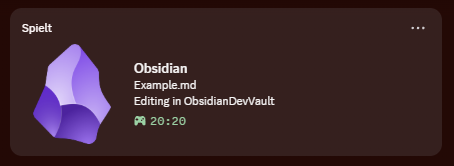

# Obsidian Presence

Show your Obsidian activity on Discord via Rich Presence — automatically displays what you're working on right in your Discord profile.

## Features

- **Vault & file name** — shows what vault and file you have open
- **Edit / Preview mode** — Discord shows whether you're reading or writing
- **Elapsed timer** — track total session time or per-file time
- **Auto-reconnect** — reconnects automatically if Discord restarts
- **Status bar indicator** — green/red dot with click-to-reconnect
- **Custom Discord Application** — bring your own Client ID and images

## Quick Links

- [Installation](installation)
- [Configuration](configuration)
- [Custom Discord App](custom-app)
- [GitHub](https://github.com/30jannik06/obsidian-presence)

## Requirements

- Obsidian **1.4.0** or higher
- Desktop only (Discord IPC is not available on mobile or web)
- Discord must be running locally
